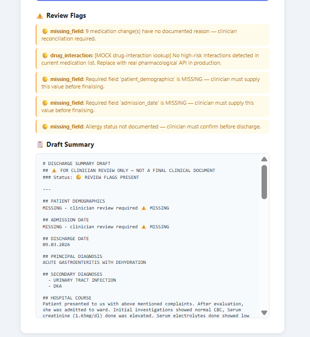
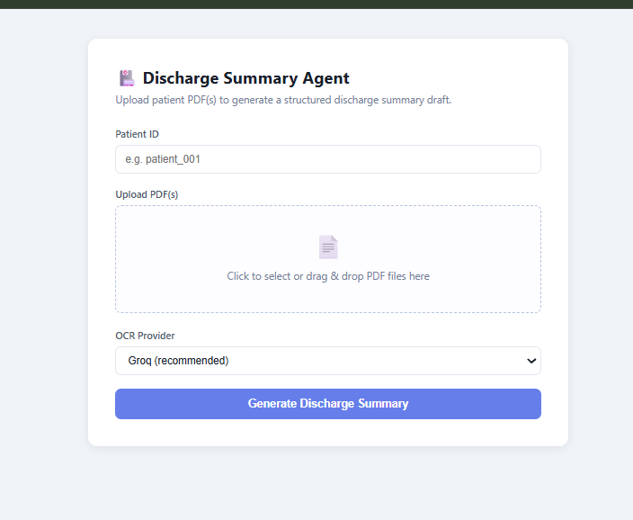

# Discharge Summary Agent

> **Live Demo:** [https://discharge-summary-agent-iqho.onrender.com](https://discharge-summary-agent-iqho.onrender.com)

An agentic AI system that reads patient medical PDFs (scanned or digital) and generates structured discharge summary drafts for clinician review. Built for the Dscribe take-home assignment.

**Core principle:** Conservative by design — any clinical data that cannot be reliably sourced from the documents is explicitly marked as `MISSING - clinician review required` rather than guessed or fabricated.

---

## Live Demo

Upload a patient PDF at the live URL and get a structured discharge summary in minutes:

👉 **[https://discharge-summary-agent-iqho.onrender.com](https://discharge-summary-agent-iqho.onrender.com)**

- Select OCR provider: **Groq** for scanned PDFs, **None** for digital PDFs (faster)
- Small PDFs (1–5 pages): ~30–60 seconds
- Large PDFs (10–70 pages): 5–15 minutes (OCR per page via Groq vision)
- Results show structured draft + review flags directly in the browser

> Note: The free Render instance may take ~30 seconds to wake up on first request.

---

## Screenshots & Demo

### Web UI Output



### Demo Video


---

### Sample Output

⚠️ Review Flags
🟡 missing_field: 9 medication change(s) have no documented reason — clinician reconciliation required.
🟡 drug_interaction: [MOCK drug-interaction lookup] No high-risk interactions detected in current medication list. Replace with real pharmacological API in production.
🟡 missing_field: Required field 'patient_demographics' is MISSING — clinician must supply this value before finalising.
🟡 missing_field: Required field 'admission_date' is MISSING — clinician must supply this value before finalising.
🟡 missing_field: Allergy status not documented — clinician must confirm before discharge.
📋 Draft Summary
# DISCHARGE SUMMARY DRAFT
## ⚠️ FOR CLINICIAN REVIEW ONLY — NOT A FINAL CLINICAL DOCUMENT
### Status: 🟡 REVIEW FLAGS PRESENT

## PATIENT DEMOGRAPHICS
MISSING - clinician review required ⚠️ MISSING

## ADMISSION DATE
MISSING - clinician review required ⚠️ MISSING

## DISCHARGE DATE
09.03.2026

## PRINCIPAL DIAGNOSIS
ACUTE GASTROENTERITIS WITH DEHYDRATION

## SECONDARY DIAGNOSES
  - URINARY TRACT INFECTION
  - DKA

## HOSPITAL COURSE
Patient presented to us with above mentioned complaints. After evaluation, she was admitted to ward. Initial investigations showed normal CBC, Serum creatinine (1.65mg/dl) done was elevated. Serum electrolytes done showed low serum sodium(128.00mnol/L). Urine routine done showed ketone bodies(+), 10-12/hpf of pus cells, 15-20/hpf of epithelial cells with presence of bactreia hence urine culture and sensitivity sent- report awaited. She was treated with IV fluids, IV antibiotics, IV PPI's, IV antiemetics and other supportive measures. USG abdomen and pelvis done showed Grade-I fatty liver changes and mildly edematous part of ascending colon upto the hepatic flexure- could represent colitis. Repeat Serum Creatinine(1.17mg/dl) done was normal. TSH and Free T4 done were normal. Stool routine done showed 2-3/hpf of red blood cells, plenty/hpf of pus cells. Patient was adviced to stay back for further management but attenders not willing to the same, hence being discharged at request with following advice.

## PROCEDURES
  - IV Cannulation done in left hand 20g

## ALLERGIES
MISSING - clinician review required ⚠️ MISSING

## DISCHARGE CONDITION
Hemodynamically stable

## ADMISSION MEDICATIONS
- MISSING - clinician review required MISSING - clinician review required MISSING - clinician review required MISSING - clinician review required

## DISCHARGE MEDICATIONS
- TAB. RACIPER 40MG BEFORE FOOD 1-0-0
- TAB. EMESET 4MG 1-1-1 3 DAYS
- TAB. OFLOX TZ MISSING - clinician review required 1-0-1 5 DAYS
- TAB M STRONG MISSING - clinician review required 1-0-0 15 DAYS
- TAB. ZEDOTT MISSING - clinician review required 1-1-1 3 DAYS
- TAB. ENTRO MISSING - clinician review required 1-0-1 3 DAYS
- TAB. MEFTAL SPAS 1 TAB SOS 4 TABLETS MISSING - clinician review required
- TAB. LOPIRAMIDE 2MG 1-0-1 5 DAYS

## MEDICATION CHANGES (Admission → Discharge)
  [ADDED] TAB. RACIPER — 40MG BEFORE FOOD 1-0-0 | Reason: MISSING - clinician review required ⚠️ RECONCILIATION REQUIRED
  [ADDED] TAB. EMESET — 4MG 1-1-1 3 DAYS | Reason: MISSING - clinician review required ⚠️ RECONCILIATION REQUIRED
  [ADDED] TAB. OFLOX TZ — MISSING - clinician review required 1-0-1 5 DAYS | Reason: MISSING - clinician review required ⚠️ RECONCILIATION REQUIRED
  [ADDED] TAB M STRONG — MISSING - clinician review required 1-0-0 15 DAYS | Reason: MISSING - clinician review required ⚠️ RECONCILIATION REQUIRED
  [ADDED] TAB. ZEDOTT — MISSING - clinician review required 1-1-1 3 DAYS | Reason: MISSING - clinician review required ⚠️ RECONCILIATION REQUIRED
  [ADDED] TAB. ENTRO — MISSING - clinician review required 1-0-1 3 DAYS | Reason: MISSING - clinician review required ⚠️ RECONCILIATION REQUIRED
  [ADDED] TAB. MEFTAL SPAS — 1 TAB SOS 4 TABLETS MISSING - clinician review required | Reason: MISSING - clinician review required ⚠️ RECONCILIATION REQUIRED
  [ADDED] TAB. LOPIRAMIDE — 2MG 1-0-1 5 DAYS | Reason: MISSING - clinician review required ⚠️ RECONCILIATION REQUIRED
  [DISCONTINUED] MISSING - clinician review required — Was: MISSING - clinician review required MISSING - clinician review required MISSING - clinician review required | Reason: MISSING - clinician review required ⚠️ RECONCILIATION REQUIRED

## FOLLOW-UP INSTRUCTIONS
Urine culture and sensitivity sent- report awaited. Review immediately in case of fever, loose stools, vomiting, fatigue. Review on 09.03.2026. CBC

## PENDING RESULTS
  - Urine culture and sensitivity


## SAFETY FLAGS & REVIEW ITEMS
  🟡 [MISSING_FIELD] 9 medication change(s) have no documented reason — clinician reconciliation required.
  🟡 [DRUG_INTERACTION] [MOCK drug-interaction lookup] No high-risk interactions detected in current medication list. Replace with real pharmacological API in production.
  🟡 [MISSING_FIELD] Required field 'patient_demographics' is MISSING — clinician must supply this value before finalising.
  🟡 [MISSING_FIELD] Required field 'admission_date' is MISSING — clinician must supply this value before finalising.
  🟡 [MISSING_FIELD] Allergy status not documented — clinician must confirm before discharge.


*Generated by Discharge Summary Agent | Patient: excreq | Steps: 6*
*THIS IS A DRAFT — All MISSING fields must be completed by clinician before finalising.*

---


## What It Does

- Extracts text from PDFs — embedded text first, Groq vision OCR as fallback
- Uses an LLM (Groq Llama 3.1) to extract structured clinical facts with source citations
- Reconciles admission vs. discharge medications and flags unexplained changes
- Runs drug interaction screening and conflict detection
- Validates all required fields and flags anything missing
- Outputs a human-readable `draft.md`, structured `summary.json`, and full `trace.jsonl` audit trail

---

## Agent Loop (8-step bounded state machine)

1. **READ_PDFS** — Extract text (embedded → Groq OCR → Tesseract → error flag)
2. **EXTRACT_FACTS** — LLM extracts all clinical fields with source quotes
3. **RECONCILE_MEDICATIONS** — Compare admission vs. discharge meds, flag changes
4. **CHECK_SAFETY** — Detect conflicts, run drug interaction screening
5. **VALIDATE** — Verify all required fields, generate missing-field flags
6. **WRITE_OUTPUTS** — Write `draft.md`, `summary.json`, `trace.jsonl`

Each step is logged with reasoning, inputs, result, and next decision.

---

## No-Fabrication Guardrail

All required fields are Pydantic models defaulting to `MISSING - clinician review required`. The LLM is required to return JSON with source quotes. If extraction fails, the agent falls back to conservative local extraction and adds a review flag — it never silently continues or invents data.

---

## Outputs

```
outputs/<patient-id>/
├── draft.md          # Human-readable discharge summary
├── summary.json      # Structured clinical data
├── trace.jsonl       # Full audit trail with reasoning
└── ocr_cache/        # Cached OCR results (avoids repeated API calls)
```

---

## Local Setup

**Requirements:** Python 3.11+

```bash
uv sync
```

Create a `.env` file:

```
GROQ_API_KEY=your_key_here
```

### Run the Agent

Single PDF:
```bash
python main.py --input data/input/patient_2.pdf --patient-id patient_2 --ocr-provider groq
```

Folder of PDFs (same patient):
```bash
python main.py --input data/input/patient_2 --patient-id patient_2 --ocr-provider groq
```

Fast smoke test (no API calls):
```bash
python main.py --input data/input/patient_2.pdf --patient-id smoke_test --no-llm --no-ocr
```

Limit OCR pages for quick testing:
```bash
python main.py --input data/input/patient_2.pdf --patient-id test --ocr-provider groq --max-ocr-pages 5
```

### Run the API locally

```bash
uvicorn api.app:app --reload
```

Then open: `http://127.0.0.1:8000/docs`

---

## Part 2: Simulated Learning from Doctor Edits

A multi-armed bandit that learns which discharge summary presentation strategy requires fewer clinician edits:

```bash
python learning/simulated_learning.py --summaries outputs/patient_2/summary.json --iterations 12 --out outputs/part2
```

**Strategies tested:**
- Baseline: `MISSING - clinician review required`
- Explicit: `NOT DOCUMENTED in source notes — clinician must supply`
- Safety First: `⛔ CRITICAL MISSING — do not finalise without this value`

Outputs: `outputs/part2/part2_metrics.json` and `outputs/part2/learning_curve.csv`

---

## Tech Stack

| Component | Technology |
|-----------|------------|
| LLM | Groq (Llama 3.1 8B) |
| Vision OCR | Groq (Llama 4 Scout) |
| Framework | FastAPI + Uvicorn |
| Agent | Custom state machine (LangGraph-inspired) |
| Data models | Pydantic v2 |
| PDF parsing | PyMuPDF |
| Hosting | Render (free tier) |

---

## Limitations & Future Work

- Drug interaction screening is rule-based; production use requires a real pharmacological API (OpenFDA, DrugBank)
- Limited to English-language PDFs
- Part 2 reviewer is synthetic — proves the feedback loop works, not that clinical quality improved
- No multi-patient timeline tracking

With more time: document type classification, table-aware medication extraction, real clinician feedback loop, HIPAA-compliant audit logging, and integration with a verified clinical knowledge base.

---

## Project Structure

```
discharge-summary-agent/
├── main.py                      # CLI entry point
├── agents/discharge_agent.py    # Core agent loop
├── api/app.py                   # FastAPI REST endpoints
├── api/ui.html                  # Web UI
├── models/schemas.py            # Pydantic data models
├── tools/pdf_reader.py          # PDF extraction + OCR
├── tools/safety.py              # Conflict detection + drug interactions
├── tools/trace.py               # Audit trail logger
├── learning/simulated_learning.py  # Part 2 bandit learner
└── outputs/                     # Generated summaries
```